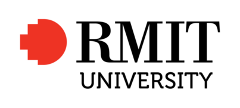

# RMIT AI'22 - Project - Pacman Capture the Flag

You must fully and carefully read the project specification and instructions detailed in this file. 

You are NOT to modify this file in any way.

* **Course:** [COSC1125/1127 Artificial Intelligence](http://www1.rmit.edu.au/courses/004123) @ Semester 2, 2022
* **Instructor:** Prof. Sebastian Sardina
* **Deadlines:**
  * **Preliminary Submission:** Sunday September 25th, 2022 @ 11:59pm (end of Week 9)
  * **Final Submission:** Sunday October 16th, 2022 @ 11:59pm (end of Week 12)
  * **Wiki+Video Submission:** Sunday October 23rd, 2022 @ 11:59pm (end of Week 13)
* **Course Weight:** 10%/15% (performance preliminary/final) + 10% (Wiki report) + 10% (Individual Video)
* **Assignment type:**: Groups of 3 (other set-ups with explicit permission)
* **CLOs covered:** 1-6
* **Submission method:** via git tagging (see below for instructions)

The purpose of this project is to implement a Pacman Autonomous Agent that can play and compete in the RMIT AI'22   _Pacman Capture the Flag tournament_:

 
 
    
    
 

 
Note that the Pacman tournament has different rules as it is a game of two teams, where your Pacmans become ghosts in certain areas of the grid. Please read carefully the rules of the Pacman tournament. Understanding it well and designing a controller for it is part of the expectations for this project. Additional technical information on the contest project can be found in file [CONTEST.md](CONTEST.md). 

### Table of contents

- [RMIT AI'22 - Project - Pacman Capture the Flag](#rmit-ai22---project---pacman-capture-the-flag)
    - [Table of contents](#table-of-contents)
  - [1. Your task](#1-your-task)
    - [Basic rules & guidelines](#basic-rules--guidelines)
  - [2. Deliverables and submission](#2-deliverables-and-submission)
    - [Preliminary code submission (Week 9, Sunday Sept 25th)](#preliminary-code-submission-week-9-sunday-sept-25th)
    - [Final code submission (Week 12, Sunday October 16th)](#final-code-submission-week-12-sunday-october-16th)
    - [Wiki report & Video (Week 13, Sunday October 24th)](#wiki-report--video-week-13-sunday-october-24th)
  - [3. Pre-contest feedback contests](#3-pre-contest-feedback-contests)
  - [4. Marking criteria](#4-marking-criteria)
  - [5. Inter-University Competition](#5-inter-university-competition)
  - [6. Important information](#6-important-information)
  - [7. AI'22 Code of Honour & Fair Play](#7-ai22-code-of-honour--fair-play)
  - [8. Conclusion](#8-conclusion)
    - [Acknowledgements](#acknowledgements)

## 1. Your task

This is a **group project**. By now, one of the team member should have registered the team in the [Project Contest Team Registration Form](https://forms.gle/Ee9jhXG8oZLHrLbY9) and tell the other students to join the team in GitHub Classroom. 

**Your task** is to develop an autonomous Pacman agent team to play the [Pacman Capture the Flag Contest](http://ai.berkeley.edu/contest.html) by suitably modifying file `myTeam.py` (and possibly some other auxiliary files you may implement). The code submitted should be internally commented at high standards and be error-free and _never crash_. 

In your solution, you have to use at **least 2 AI-related techniques** (**3 techniques at least for groups of 4**) that have been discussed in the subject or explored by you independently, and you can combine them in any form. Some candidate techniques that you may consider are:

1. Heuristic Search Algorithms (using general or Pacman specific heuristic functions).
2. Classical Planning (PDDL and calling a classical planner).
3. Value Iteration (Model-Based MDP).
4. Monte Carlo Tree Search or UCT (Model-Free MDP).
5. Reinforcement Learning – classical, approximate or deep Q-learning (Model-Free MDP).
6. Goal Recognition techniques (to infer intentions of opponents).
7. Game Theoretic Methods.
8. Bayesian inference.

You can always use hand coded decision trees to express behaviour specific to Pacman, but they won't count as a required technique. You are allowed to express domain knowledge, but remember that we are interested in "autonomy", and hence using techniques that generalise well. The 7 techniques mentioned above can cope with different rules much easier than any decision tree (if-else rules). If you decide to compute a policy, you can save it into a file and load it at the beginning of the game, as you have 15 seconds before every game to perform any pre-computation.

Together with your actual code solution, you will need to develop a Wiki report, documenting and describing your solution (both what ended up in the final system and what didn't), as well as a 5-min recorded video demonstrating your work in the project. Both these components are very important, as it can be seen by their weights.
 
### Basic rules & guidelines

When developing and submitting a solution, please make absolutely sure you adhere to the following base rules and guidelines:

* You must ALWAYS keep your fork **private** and **never share it** with anybody in or outside the course, except your teammates, _even after the course is completed_. You are **not allowed to make another repository copy outside the provided GitHub Classroom** without the written permission of the teaching staff. Please respect the [authors request](http://ai.berkeley.edu/project_instructions.html):

  > **_Please do not distribute or post solutions to any of the projects._**

* Your code **must run _error-free_ on Python 3.6+**. Staff will not debug/fix any code. If your code crashes in any execution, it will be disqualified from the contest.

* Your code **must not contain any personal information**, like your student number or your name. That info should go in the [TEAM.md](TEAM.md) file, as per instructions below. If you use an IDE that inserts your name, student number, or username, you should disable that.

* You are **not to change or affect (e.g., redirect) the standard output or error channels** (`sys.stdout` and `sys.stderr`) beyond just printing on standard output. If your file mentions any of them it will be breaking the "fair play" of the course (see below). These are used to report each game output and errors, and they should not be altered as you will be interfering negatively with the contest and with the other team's printouts. 

* Being a group assignment, you must **use your project Github** repository and team to collaborate among the members. 

## 2. Deliverables and submission

There will be two code submissions for this project and one wiki+video submission. 

Always submit substantially before the deadline, preferably one day before. Submitting close to the deadline could be risky and you may fail to submit on time, for example due to loss of Internet connection or server delays. 

### Preliminary code submission (Week 9, Sunday Sept 25th)

In the **preliminary submission** you are to:
 
1. Submit your first working version of your solution, by tagging the commit as "`preliminary`". 
2. Fill the [Project Certification \& Contribution Form (PRELIMINARY)](https://forms.gle/1h8HyM4XDNeNjAD47).
    * Each member of the team should fill a separate certification form. Members who do not certify will not be marked and will be awarded zero marks.

### Final code submission (Week 12, Sunday October 16th)

In the **final submission** you are to submit your final submission to the project, which includes:

1. The `myTeam.py` implementing your AI-based Pacman agent team as per instructions above by tagging the relevant commit as "`submission`". 
2. A completed [TEAM.md](TEAM.md) file, with all the team member details. 

### Wiki report & Video (Week 13, Sunday October 24th)

As part of the final project, you will be need to submit:

1. A **_team_ Wiki report** in your GitHub team repository, documenting and critically analysing your Pacman agent system. 
   * The report is a team submission, so every member should contribute to it.
   * At the very minimum the Wiki should describe the approaches implemented, a small table comparing the different agents/techniques you tried showing their performances in several scenarios, and an analysis of the strengths and weaknesses of your solution. For example, you may want to show how the addition of a given technique or improvement affected your system at some important point in the development. 
   * The description and analysis should include the techniques that made it to the final system, but you are encourage to report on techniques that you tried enough but did not make it to the final system. Explain why some techniques were not used in the final system, future extensions or improvements on your system, etc.
2. An **_individual_ recorded 5-minute oral presentation** that outlines the theoretical and/or experimental basis for the design of your agents (i.e. why you did what you did), challenges faced, and what you would do differently if you had
more time. 
   * Each member will design and record their _own_ video presentation, probably putting emphasis on what the member has contributed. Please include name and student number at the start of the presentation.
   * Showing live demos to depict different implementations, techniques, challenges, etc. is often a good idea in the presentations. 
   * The video will be shared with us through an unlisted youtube link in the Wiki of your GitHub repository.
3. A filled [Project Certification & Contribution Form (FINAL)](https://forms.gle/c3VPYzqKhwmJMZh87).
    * Each member of the team should fill a separate certification form. Members who do not certify will not be marked and will be awarded zero marks.
    * You will reflect on the team contribution with respect to the codebase, report, and video.

**IMPORTANT:** As can be seen by their weighting, the report and video are important components of the project. We strongly recommend working on them *during the development of the project and your system*, for example, by collecting data, screenshots, videos, notes, observations, etc. that may be relevant and potentially useful. Do not leave these components to the last minute, as you may not have enough time to put them together at a high-quality.

## 3. Pre-contest feedback contests

We will be running **_feedback_ contests** based on preliminary versions of teams' agents in the weeks before the final project submission. We will start once **five teams** have submitted their preliminary agents by tagging their repos with "`testing`".

Participating in these pre-contests will give you **a lot of insights** on how your solution is performing and how to improve it. Results, including replays for every game, will be available only for those teams that have submitted. 

You can re-submit multiple times, and we will just run the version tagged `testing`. These tournaments carry no marking at all; they are just designed for **continuous feedback** for you to  analyse and improve your solution! You do not need to certify these versions.

We will try to run these pre-competitions frequently, at least once a day once enough teams are submitting versions.

The earlier you submit your agents, the more feedback you will receive and the better your chances of earning a high ranking!

## 4. Marking criteria

The overall project marks (worth 45% total of the course) are as follows:

| Component                                    | Marks  |
|--------------------------------------------- | ------ |
| Performance of the preliminary submission    | 10     |
| Performance of the final submission          | 15     |
| Quality of Wiki and types of techniques used | 10     |
| Quality of Video presentation                | 10     |
| Total                                        | 45     |

Note that the Wiki and Video are a *major* component of the project: they are  important places where you can demonstrate your knowledge of the material covered. This implies that you may achieve good marks without a top-top agent, as long as you are able to show concrete evidence in your Wiki+Video of the knowledge and skills you achieved during the project (including showing an analysis of what was tried but did not work!)

In both the preliminary and final submissions, a "contest" will be run between each submission and a set of **predefined reference staff teams** over many fixed and random layouts (there will be no games among submissions themselves). Then, the performance of each submitted team is evaluated relative to the % of points it managed to attract when playing all the reference teams as follows (won game = 3 points, tie games = 1 point, and loss game = 0 points):

| % of points in contest  | Preliminary Contest Marks | Final Contest Marks |
| -----------------     | ------------------- | ------------- |
| 25%                   | 4                   | 1             |
| 38%                   | 7                   | 4             |
| 53%                   | 8                   | 9             |
| 88%                   | 10                  | 15            |
| Winner of contest     | 1 (bonus)           | 2 (bonus)     |

The precise number of marks will be calculated between the above % bands in a linear way. The only exception is the top band: once a submitted team attracts 88% of the contest points, it will earn full p points (10 or 15). Note that the requirements are much less for the preliminary contest, in which obtaining 25% of the contest points already yields 4 of 10 marks.
 
The above % bands of attracted points in a contest are based on the performance of four _baseline_ agents when these play the reference agents. For example, our extremely _basic agent_ which has very little intelligence and uses rudimentary techniques manages to attract 25% of the points when playing the reference teams. For an agent to demonstrate some level of AI knowledge and skills, it needs to perform above that (in the final contest). 

**NOTE:** Submission will not compete among themselves, but only against the staff reference teams.

In the final submission, the top-8 will enter into a playoff series to play quarterfinals, semi-finals and finals, time permitting live in the last day of class or in week 13 in a day specified for that (these final phases will not be part of the marking criteria, just bonus marks). Diplomas will be awarded to all teams entering the final playoff series.

Additional technical details can be found in [CONTEST.md](CONTEST.md). 

The final performance marks together with the **quality of the Wiki and the video** will determine the marks earned for the *final* submission (out of 35; without taking the preliminary submission), then finally adjusted and weighted as per **individual contribution** and **SE quality practices** (see below) as needed. So, for example:

* A PASS (17.5 marks out of 35) can be achieved by getting 80% for Wiki+Video and attracting just a bit more than 25% in the final contest (i.e., performing a bit better than the staff basic system). Alternatively, a PASS can be reached as well with 50% of the Wiki+Video's marks (10 in total) and 7.5 marks in the final contest (i.e., close to 50% of points attracted).
* An HD (28 marks out of 35) cannot be achieved without attracting 50%+ points in the contest (even with a perfect Wiki and Video), which corresponds to performing comparable to our top baseline agents.

Besides the correctness and performance of your solutions, you **must follow good and professional SE practices**, including good use of git version control and professional communication and team-work during your development. Please refer to the [SE and GIT Best Practices](https://github.com/RMIT-COSC1127-1125-AI22/AI22-DOC/blob/main/SE-PRACTICES.md) guidelines on what is expected as a minimum when developing your solutions. When in doubt, please ask, and ask early enough.

**We will inspect the commit history in your remote repo** and the **GitHub team** to check for good and proper SE practices and evidence of meaningful contributions of _all_ members. The results of these checks can affect the overall individual marks _significantly_, as point deductions may be applied when poor SE practices have been used or no clear evidence of contributions can be found. 
  * For example, few commits with a lot of code changes may result in significant deductions and may even yield very few or no marks awarded, even if the performance of the submission is excellent.
  * No or poor communication in the corresponding GitHub team will also attract significant deductions. 
  * Overall, the remote GitHub repo and team must **provide concrete  evidence of the workings towards the final submission**. 
  * Please refer to [this](https://github.com/RMIT-COSC1127-1125-AI22/AI22-DOC/blob/main/FAQ-PACMAN.md#why-do-we-need-to-show-good-segit-processes) and [this](https://github.com/RMIT-COSC1127-1125-AI22/AI22-DOC/blob/main/FAQ-PACMAN.md#can-i-just-add-dummypadding-commits-to-have-more-commits) related questions in the FAQ.

**We reserve the right to call for team and/or individual interviews when needed.**

## 5. Inter-University Competition

The top teams of the final tournament will be inducted to the [RMIT-UoM Pacman Hall of Fame](https://sites.google.com/view/pacman-capture-hall-fame/) and will qualify to the yearly championship across RMIT and The University of Melbourne, which runs every year with the best teams since 2017 onward (given you grant us permission, of course). This is just "for fun" and will attract no marks, but is something that previous students have stated in their CVs!

## 6. Important information

**Corrections:** From time to time, students or staff find errors (e.g., typos, unclear instructions, etc.) in the assignment specification. In that case, a corrected version of this file will be produced, announced, and distributed for you to commit and push into your repository.  Because of that, you are NOT to modify this file in any way to avoid conflicts.

**Late submissions & extensions:** A penalty of 10% of the maximum mark per day will apply to late assignments up to a maximum of five days, and 100% penalty thereafter. Extensions will only be permitted in _exceptional_ circumstances. Refer to the [Course FAQ](https://github.com/RMIT-COSC1127-1125-AI22/AI22-DOC/blob/main/FAQ-COURSE.md) for common questions related to this.

**Academic Dishonesty:** This is an advanced course, so we expect full professionalism and ethical conduct.  Plagiarism is a serious offense. Please **don't let us down and risk our trust**. 
  * Sophisticated _plagiarism detection_ software via [Codequiry](https://codequiry.com/) will be used in this edition to check submitted code against other submissions in the class as well as resources available on the web. These systems are really smart, so just do not risk it and keep professional and safe. 
  * Remember, if a solution is "out there", we also have it :-)
  * We trust you all to submit your own work only; again, don't let us down. If you do, we will pursue the strongest consequences available to us according to the **University Academic Integrity policy**. 
  * In a nutshell, **never even look at solution done by others**, either in (e.g., classmate) or outside (e.g., web) the course: they have already done their learning, this is your opportunity! If you refrain from this behavior, you are safe. For more information on this see file [Academic Integrity](https://github.com/RMIT-COSC1127-1125-AI22/AI22-DOC/blob/main/ACADEMIC_INTEGRITY.md).

**We are here to help!:** We are here to help you! But we don't know you need help unless you tell us. We expect reasonable effort from your side, but if you get stuck or have doubts, please seek help. We will run a drop-in lab to support these projects, so use that! While you have to be careful to not post spoilers in the forum, you can always ask general questions about the techniques that are required to solve the projects. If in doubt whether a questions is appropriate, post a Private post to the instructors.

**Silence Policy:** A silence policy will take effect 2 days before this assignment is due. This means that no question about this assignment will be answered, whether it is asked on the newsgroup, by email, or in person after that time.

## 7. AI'22 Code of Honour & Fair Play

We expect every RMIT student taking this course to adhere to the **AI'22 Course Code of Honour** under which every learner-student should:

* Submit their own original work.
* Do not share answers with others.
* Report suspected violations.
* Not engage in any other activities that will dishonestly improve their results or dishonestly improve or damage the results of others.

Being a contest, we expect **fair play** of all teams in this project. If you are in doubt of whether something would break the good spirit of the project, you must check with us early, not wait to be discovered. Any behaviour or code providing an unfair advantage or causing harm will be treated very seriously. We trust you, do not let us down and be a fair player.

Unethical behaviour is extremely serious and consequences are painful for everyone. We expect enrolled students/learners to take full **ownership** of your work and **respect** the work of teachers and other students.

## 8. Conclusion

This is the end of the project assessment specification. Remember to also read the [CONTEST.md](CONTEST.md) file containing technical information that will come very useful (including chocolate prizes for the winners!).

If you still have doubts about the project and/or this specification do not hesitate asking in the [Course EdStem Discussion Forum](https://edstem.org/au/courses/8118) and we will try to address it as quickly as we can!

**I very much hope you enjoy this final contest project and learn from it a lot**. 

**GOOD LUCK & HAPPY PACMAN!**

Sebastian

### Acknowledgements

This is [Pacman Capture the Flag Contest](http://ai.berkeley.edu/contest.html) from the set of [UC Pacman Projects](http://ai.berkeley.edu/project_overview.html). I am very grateful to UC Berkeley CS188 for developing and sharing their system with us for teaching and learning purposes.

I also acknowledge the fantastic support from tutor Andrew Chester in setting up and running this sophisticated project assessment. 